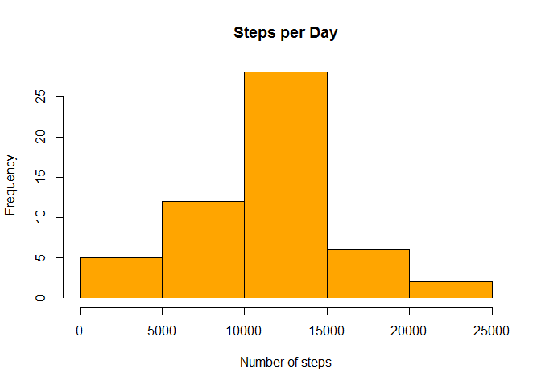
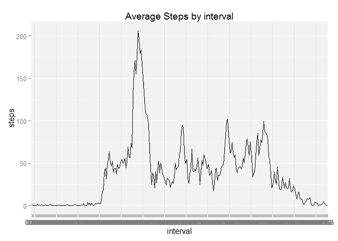
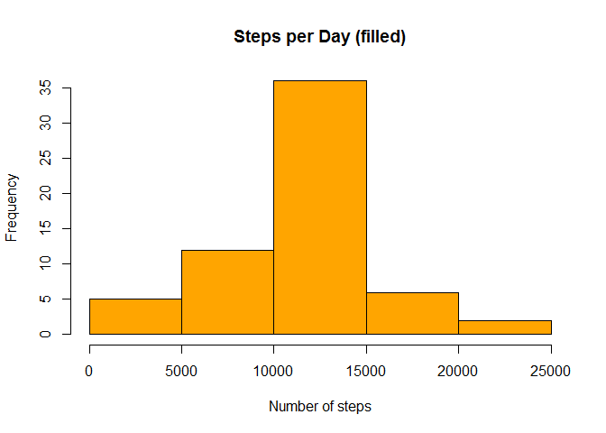
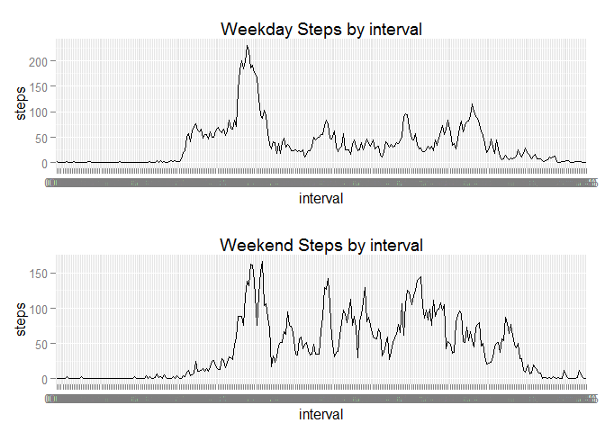

# BeauchampPeerAssessment1
Bruce  
September 16, 2015  

Bruce Beauchamp Reproducible Research Peer Assignment 1
=======================================================

This is the first peer-reviewable assignment for the Coursera Reproducible Research course.


Loading and preprocessing the data
----------------------------------

Show any code that is needed to

**1.Load the data (i.e. read.csv())**


```r
library(stringr)

raw_steps_data <- read.csv(file="activity.csv", header=TRUE, sep=',')
head(raw_steps_data)
```

```
##   steps       date interval
## 1    NA 2012-10-01        0
## 2    NA 2012-10-01        5
## 3    NA 2012-10-01       10
## 4    NA 2012-10-01       15
## 5    NA 2012-10-01       20
## 6    NA 2012-10-01       25
```


**2.Process/transform the data (if necessary) into a format suitable for your analysis**

The following code removes the rows containing NA values, and left pads the interval column with zeros, to 4 characters.


```r
raw_steps_data$interval = str_pad(raw_steps_data$interval, 4, pad="0")
steps_data <- na.omit(raw_steps_data)
steps_data$interval = str_pad(steps_data$interval, 4, pad="0")
head(steps_data)
```

```
##     steps       date interval
## 289     0 2012-10-02     0000
## 290     0 2012-10-02     0005
## 291     0 2012-10-02     0010
## 292     0 2012-10-02     0015
## 293     0 2012-10-02     0020
## 294     0 2012-10-02     0025
```

3. What is mean total number of steps taken per day?


```r
steps_by_date <- aggregate(steps~date, steps_data, sum)
mean_total = mean(steps_by_date$steps)
mean_total
```

```
## [1] 10766.19
```


**1.Calculate the total number of steps taken per day**


```r
steps_by_date <- aggregate(steps~date, steps_data, sum)
head(steps_by_date)
```

```
##         date steps
## 1 2012-10-02   126
## 2 2012-10-03 11352
## 3 2012-10-04 12116
## 4 2012-10-05 13294
## 5 2012-10-06 15420
## 6 2012-10-07 11015
```


**2. Make a histogram of the total number of steps taken each day**


```r
steps_by_date <- aggregate(steps~date, steps_data, sum)
hist(steps_by_date$steps, main='Steps per Day', col='orange', xlab='Number of steps')
```

 


**3.Calculate and report the mean and median of the total number of steps taken per day**


```r
mean_total = mean(steps_by_date$steps)
med_total = median(steps_by_date$steps)
mean_total
```

```
## [1] 10766.19
```

```r
med_total
```

```
## [1] 10765
```


**What is the average daily activity pattern?**

**1.Make a time series plot (i.e. type = "l") of the 5-minute interval (x-axis) and the average number of steps taken, averaged across all days (y-axis)**


```r
library(ggplot2)
library(grid)
library(gridExtra)

avg_steps_by_interval <- aggregate(steps~interval, steps_data, mean )
head(avg_steps_by_interval)
```

```
##   interval     steps
## 1     0000 1.7169811
## 2     0005 0.3396226
## 3     0010 0.1320755
## 4     0015 0.1509434
## 5     0020 0.0754717
## 6     0025 2.0943396
```

```r
ggplot(avg_steps_by_interval, aes(x=interval, y=steps, group=1)) + 
  geom_line() +
  ggtitle('Average Steps by interval')
```

 

**2.Which 5-minute interval, on average across all the days in the dataset, contains the maximum number of steps?**


```r
max_row_index = which.max(avg_steps_by_interval[,2])
max_steps_avg = avg_steps_by_interval[max_row_index, 1]
max_steps_avg
```

```
## [1] "0835"
```


**Imputing missing values**

Note that there are a number of days/intervals where there are missing values (coded as NA). The presence of missing days may introduce bias into some calculations or summaries of the data.

**1.Calculate and report the total number of missing values in the dataset (i.e. the total number of rows with NAs)**


```r
na_df <- subset(raw_steps_data, is.na(raw_steps_data$steps))
nrow(na_df)
```

```
## [1] 2304
```


**2.Devise a strategy for filling in all of the missing values in the dataset. The strategy does not need to be sophisticated. For example, you could use the mean/median for that day, or the mean for that 5-minute interval, etc.**

The strategy used here is to replace any missing value by the average number of steps for that interval.


```r
filled_raw_steps_data = raw_steps_data
for(i in 1:nrow(filled_raw_steps_data))
{ 
  steps_value = filled_raw_steps_data[i, "steps"]
  if (is.na(steps_value))
  {
    interval_value = filled_raw_steps_data[i, "interval"]
    avg = (avg_steps_by_interval[avg_steps_by_interval$interval == interval_value, 2])
    filled_raw_steps_data[i, "steps"] = avg
  }
}
```

**3.Create a new dataset that is equal to the original dataset but with the missing data filled in.**


```r
head(filled_raw_steps_data)
```

```
##       steps       date interval
## 1 1.7169811 2012-10-01     0000
## 2 0.3396226 2012-10-01     0005
## 3 0.1320755 2012-10-01     0010
## 4 0.1509434 2012-10-01     0015
## 5 0.0754717 2012-10-01     0020
## 6 2.0943396 2012-10-01     0025
```

**4.Make a histogram of the total number of steps taken each day and Calculate and report the mean and median total number of steps taken per day. Do these values differ from the estimates from the first part of the assignment? What is the impact of imputing missing data on the estimates of the total daily number of steps?**


```r
steps_by_date_filled <- aggregate(steps~date, filled_raw_steps_data, sum)
hist(steps_by_date_filled$steps, main='Steps per Day (filled)', col='orange', xlab='Number of steps')
```

 

```r
imputed_mean_total = mean(steps_by_date_filled$steps)
imputed_med_total = median(steps_by_date_filled$steps)
imputed_mean_total
```

```
## [1] 10766.19
```

```r
imputed_med_total
```

```
## [1] 10766.19
```

Imputing the missing data made no change in the averages (probably because the imputation replaced missing values with the interval average), and changed the median value by approximately 1/100 of a percent.  Overall, imputing the data had a negligible effect.

**Are there differences in activity patterns between weekdays and weekends?**

For this part the weekdays() function may be of some help here. Use the dataset with the filled-in missing values for this part.


```r
steps_by_date_filled$day <- weekdays(as.Date(steps_by_date_filled$date))
head(steps_by_date_filled)
```

```
##         date    steps       day
## 1 2012-10-01 10766.19    Monday
## 2 2012-10-02   126.00   Tuesday
## 3 2012-10-03 11352.00 Wednesday
## 4 2012-10-04 12116.00  Thursday
## 5 2012-10-05 13294.00    Friday
## 6 2012-10-06 15420.00  Saturday
```


**1.Create a new factor variable in the dataset with two levels - "weekday" and "weekend" indicating whether a given date is a weekday or weekend day.**


```r
weekdays_list = c('Monday', 'Tuesday', 'Wednesday', 'Thursday', 'Friday')
steps_by_date_filled$day_of_week_type <- ifelse(steps_by_date_filled$day %in% weekdays_list,
                                                'weekday', 'weekend')
head(steps_by_date_filled)
```

```
##         date    steps       day day_of_week_type
## 1 2012-10-01 10766.19    Monday          weekday
## 2 2012-10-02   126.00   Tuesday          weekday
## 3 2012-10-03 11352.00 Wednesday          weekday
## 4 2012-10-04 12116.00  Thursday          weekday
## 5 2012-10-05 13294.00    Friday          weekday
## 6 2012-10-06 15420.00  Saturday          weekend
```


**2.Make a panel plot containing a time series plot (i.e. type = "l") of the 5-minute interval (x-axis) and the average number of steps taken, averaged across all weekday days or weekend days (y-axis).**


```r
#  First, add the day of week and the day of week type to the imputed data
filled_raw_steps_data$day <- weekdays(as.Date(filled_raw_steps_data$date))
filled_raw_steps_data$dow_type <- ifelse(filled_raw_steps_data$day %in% weekdays_list,
                                         'weekday', 'weekend')

weekday_df = filled_raw_steps_data[filled_raw_steps_data$dow_type=="weekday", ]
weekend_df = filled_raw_steps_data[filled_raw_steps_data$dow_type=="weekend", ]


#  Now get the weekday and weekend interval averages
weekday_intervals = aggregate(steps~interval, weekday_df, mean)
weekend_intervals = aggregate(steps~interval, weekend_df, mean)

plot1 <- ggplot(data=weekday_intervals, aes(x=interval, y=steps, group=1)) + 
  geom_line() +
  ggtitle('Weekday Steps by interval')

plot2 <- ggplot(data=weekend_intervals, aes(x=interval, y=steps, group=1)) + 
  geom_line() +
  ggtitle('Weekend Steps by interval')

grid.arrange(plot1, plot2, ncol=1)
```

 


